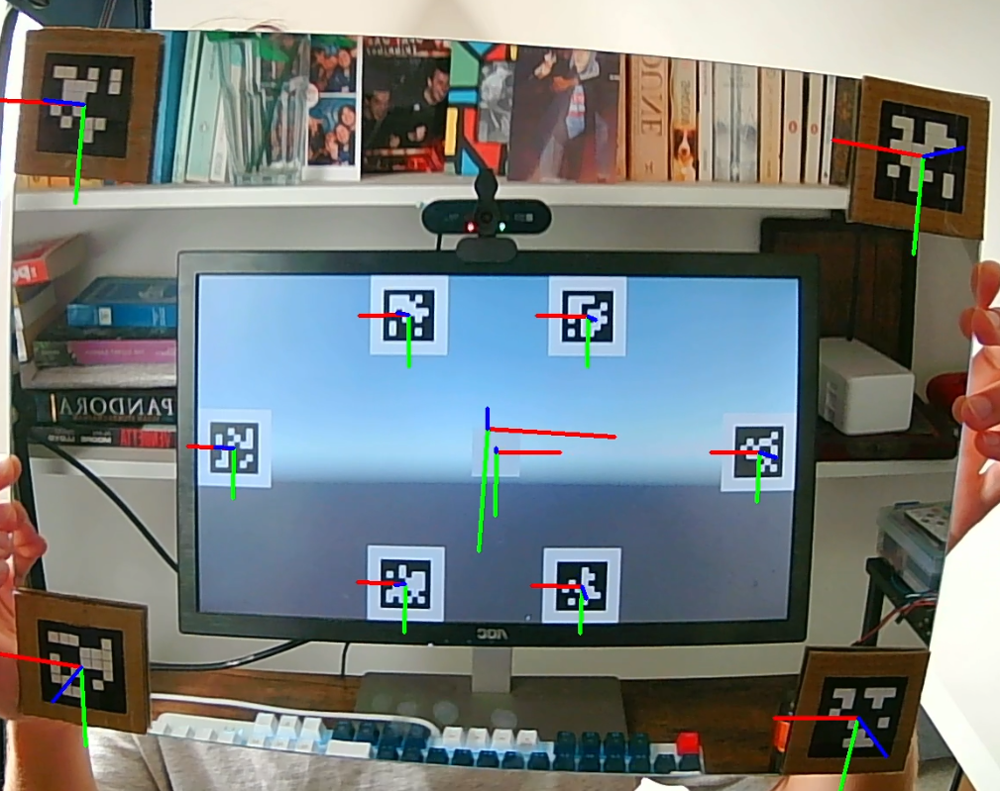

# VitraView - A VR Window-Like effect for common monitors. (OpenCV, C++, Unity) (WIP)
## Overview

VitraView is an experimental project that turns any monitor into a "window-like" VR display. By combining real-time eye tracking with a novel extrinsics calibration technique, it dynamically adapts perspective rendering so the scene reacts naturally to the viewer’s position. No headset required.

To note: This project is still under development and the code & demo will be uploaded in the near future. 

## Components
- Novel camera extrinsics technique.
- 3D Eye tracking from IPD and pixel coordinates.
- Kalman filtering & Exponential Smoothing.
- Unity demo project.

## Demo Outputs

*Simple demo VR window effect as seen from users perspective.*

*VitraView perspective compared to regular rendering.*

*Sailing game demo VR window effect with direct camera tracking (not eye tracking). To note: Stabilisation was added later to video.*

*Camera extrinsics calibration using a mirror.*

## Limitations & Future Improvements
- Parallelized OpenCV DNN for faster eye detection.
- Entirely separate camera calibration unitility.
- Improved dev tools Unity->C++ for faster tracking parameter testing.

